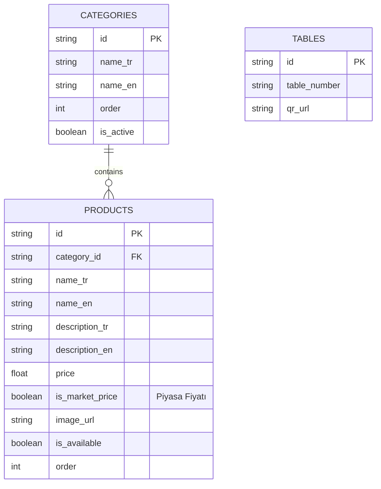
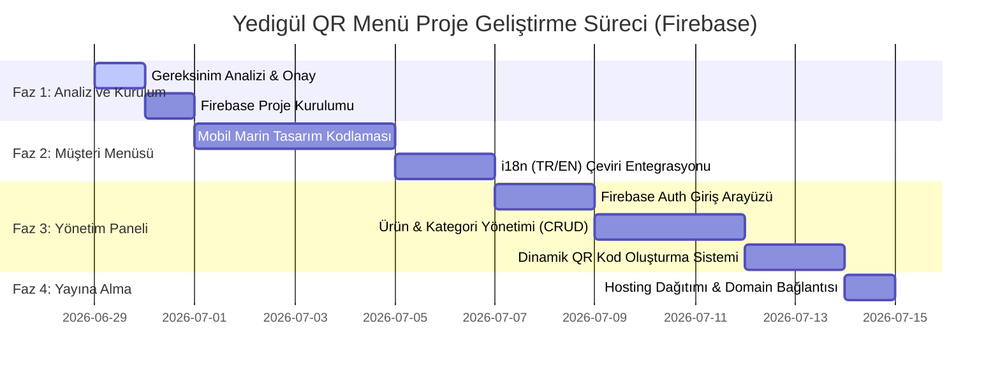

> [!WARNING]
> **BU BELGE GÜNCEL DEĞİLDİR (2026-07-03).** Firebase, "sadece mobil" ve masa bazlı QR varsayımları terk edildi.
> Güncel mimari, kurallar ve komutlar için kök dizindeki `CLAUDE.md` dosyasına bakın.

# Yedigül Restaurant QR Menü Sistemi Uygulama Planı

Bu plan, Anadolukavağı Yedigül Restaurant için tasarlanacak QR menü sisteminin mimari yapısını, seçilen teknoloji yığını ve mobil odaklı geliştirme esaslarını içerir.

---

## Proje Kuralları & Kapsam

*   **Mobil ve Tablet Odaklılık (Zorunluluk):**
    *   QR menü sadece mobil telefon ve tablet cihazlar için optimize edilecektir. Masaüstü görünümü için ekstra bütçe ve tasarım harcanmayacaktır.
    *   Her geliştirilen özellik, doğrulanmadan önce **mobil uyumluluk (mobil responsive)** süzgecinden geçirilecek ve düzgün görüntülendiği kesinleştirilmeden tamamlandı olarak işaretlenmeyecektir.

*   **Kilitlenen Teknoloji Yığını (Tech Stack Lock):**
    *   **Frontend:** React (Vite altyapısı)
    *   **Styling:** TailwindCSS
    *   **Backend & Veritabanı:** Firebase (Authentication, Firestore NoSQL, Firebase Hosting)

*   **Dinamik QR Kod Altyapısı:**
    *   İlk etapta sadece menü görüntüleme aktif olacak.
    *   QR kodlar masa bazlı benzersiz linklerle oluşturularak ileride **garson çağırma, hesap isteme veya sipariş verme** gibi etkileşimli özelliklere tam uyumlu bir altyapı kurulacaktır.

---

## Sistem Mimarisi

### 🏢 Veritabanı Şeması (Firestore)



### 📂 Dosya Yapısı Planı

```
src/
├── assets/             # Görseller, logolar (Marin tema kaynakları)
├── components/         # Ortak bileşenler
│   ├── ui/             # Temel UI elemanları (Button, Card, Badges - Mobil Uyumlu)
│   ├── client/         # Müşteri mobil menü bileşenleri
│   └── admin/          # Yönetici paneli mobil/tablet uyumlu bileşenleri
├── context/            # AuthContext, MenuContext (Global state)
├── firebase/           # firebaseConfig.ts ve Firestore servisleri
├── i18n/               # Dil dosyaları (tr.json, en.json) ve çeviri altyapısı
├── layouts/            # Müşteri ve Admin layout'ları (Tamamen mobil uyumlu)
├── pages/              # Sayfa bileşenleri (Menu, AdminLogin, AdminDashboard)
├── styles/             # Global CSS ve Tailwind özelleştirmeleri
├── App.tsx             # Ana uygulama bileşeni ve yönlendirmeler
└── main.tsx            # Giriş noktası
```

### 🎨 Tasarım Kriterleri (Marin/Boğaz Konsepti)
*   **60-30-10 Renk Kuralı:** 
    *   %60 Arka Plan/Baskın Renk: Saf Beyaz ve Açık Gri Tonları (Karanlık mod için Derin Lacivert `#0A192F`).
    *   %30 İkincil Renk: Derin Deniz Mavisi / Lacivert (`#1E3A8A` - Yazılar, kart sınırları, başlıklar).
    *   %10 Vurgu Rengi: Altın / Kum Sarısı (`#D97706` - Fiyatlar, önemli butonlar, vurgular).
*   **Tipografi:** Google Fonts Outfit veya Inter (Okunabilirliği yüksek, premium fontlar).

---

## Geliştirme Planı (Fazlar)



---

## Doğrulama Planı (Verification)

### Mobil Doğrulama Kriterleri
1.  **Cihaz Simülasyonu:** Geliştirilen tüm menü arayüzü ve admin sayfaları iOS (Safari) ve Android (Chrome) mobil tarayıcılarında, en küçük ekran boyutlarında (320px genişlikten itibaren) test edilecek, taşma veya okunurluk problemi olmadığı doğrulanacaktır.
2.  **Yatay/Dikey Ekran Desteği:** Telefonların yatay ve dikey döndürülme senaryolarında arayüzün kendini düzgün biçimde yeniden boyutlandırdığı test edilecektir.
3.  **Dinamik Link Testi:** `/menu?masa=5` veya `/masa/5` URL'siyle giriş yapıldığında, uygulamanın masa bilgisini mobil cihazda state'e aldığı ve sayfanın başarıyla yüklendiği doğrulanacaktır.
4.  **Dil Değiştirme Testi:** Dil seçiciden (TR/EN) geçiş yapıldığında, kategori isimleri, ürün açıklamaları ve "Piyasa Fiyatı" ibaresinin anında ilgili dile çevrildiği gözlemlenecektir.
5.  **Fiyat Güncelleme Hızı:** Admin panelinden yapılan bir balık fiyatı güncellemesinin, müşteri ekranında sayfa yenilenmeden (Firestore realtime listener sayesinde) anında değiştiği doğrulanacaktır.
